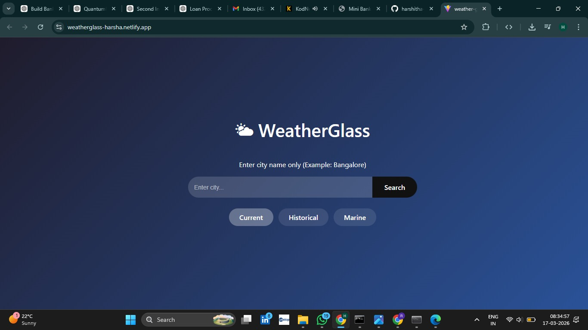
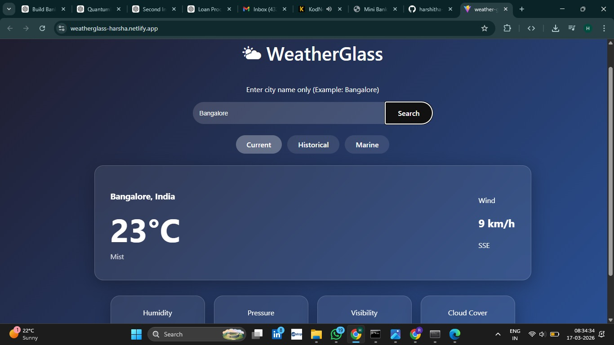
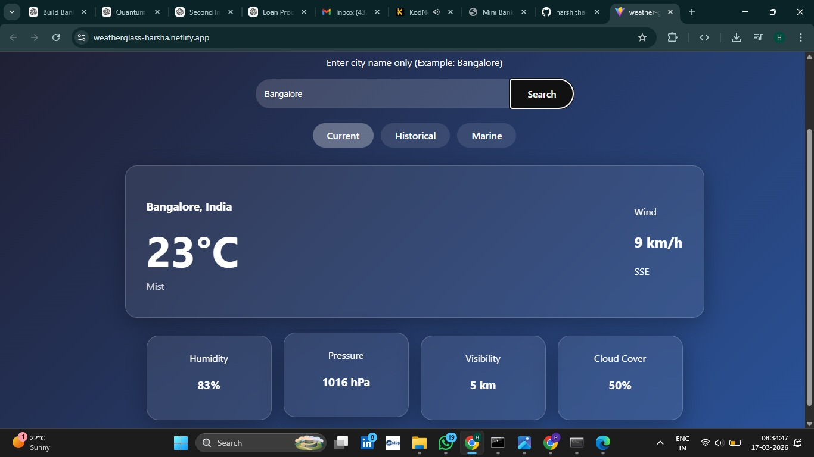
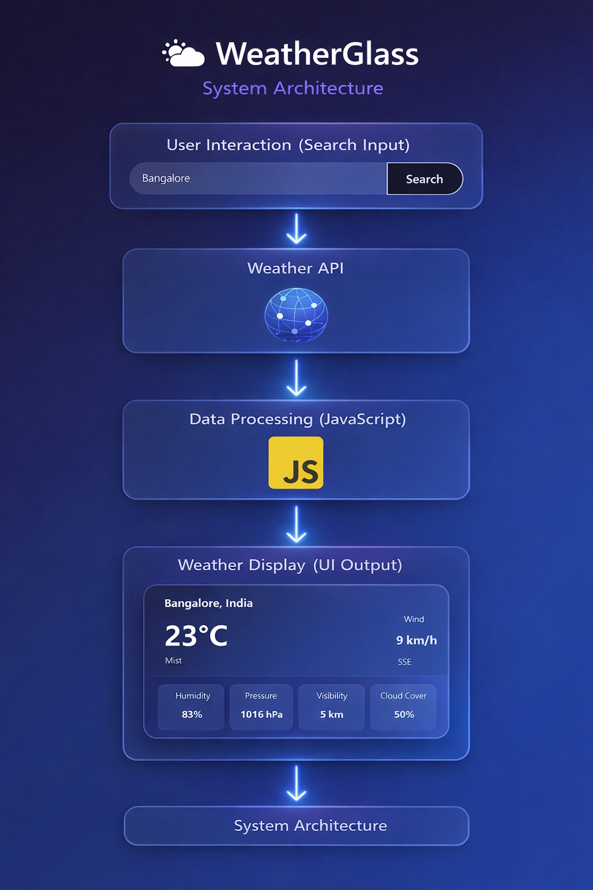

# WeatherGlass – Weather Forecasting Application

> A web-based weather forecasting application that provides real-time weather information using API integration with a clean glassmorphism user interface.

WeatherGlass is a frontend-focused web application that allows users to search for any city and instantly view current weather conditions such as temperature, humidity, wind speed, pressure, and visibility.

This project demonstrates API integration, real-time data handling, and modern UI design using glassmorphism.

---

## Important Note

This repository contains the core implementation of the WeatherGlass system.

Some development configurations, API key handling, and local testing setups are not included in this public repository.

Only the necessary files required to demonstrate functionality and system design are provided.

---

## Project Overview

Weather forecasting applications are essential for daily planning and decision-making.

WeatherGlass simplifies this by allowing users to:

- Search weather by city name  
- View real-time temperature  
- Check humidity and pressure  
- See wind speed and direction  
- Analyze visibility and cloud cover  

The system uses API-based data fetching and dynamically updates the UI.

---

## Problem Statement

Users need quick and accurate access to weather information without navigating complex applications.

WeatherGlass addresses this by:

- Providing a simple search-based interface  
- Fetching real-time weather data using APIs  
- Displaying data in a clean and user-friendly format  

This improves accessibility and usability of weather information.

---

## Live Website

Live Application:

https://weatherglass-harsha.netlify.app/

---

## High-Level System Architecture

    User enters city name
            ↓
    Request sent to Weather API
            ↓
    API returns weather data (JSON)
            ↓
    JavaScript processes data
            ↓
    UI dynamically updates
            ↓
    Weather details displayed to user

---

## Interface

  

---

## Search Input

  

---

## Weather Output

  

---

## System Architecture

  

---

## Working Process

1. User enters a city name  
2. Application sends request to weather API  
3. API returns real-time weather data  
4. JavaScript processes the response  
5. UI updates dynamically  
6. Weather details are displayed  

---

## Technologies Used

- HTML  
- CSS  
- JavaScript  
- Weather API  
- Netlify  

---

## Results

WeatherGlass successfully provides real-time weather data including temperature, humidity, wind speed, and visibility.

The application delivers:

- Fast API response handling  
- Clean glassmorphism UI  
- Accurate weather updates  
- Interactive user experience  

---

## Repository Structure

    weather-glass/
    │
    ├── assets/                # Images used for project documentation
    │   ├── interface.jpeg
    │   ├── search.jpeg
    │   ├── output.jpeg
    │   └── architecture.png
    │
    ├── public/                # Static public files
    ├── src/                   # React source code (components, logic)
    │
    ├── index.html             # Entry HTML file
    ├── style.css              # Styling (if used separately)
    ├── script.js              # JavaScript logic (if applicable)
    │
    ├── package.json           # Project dependencies and scripts
    ├── package-lock.json      # Dependency lock file
    ├── vite.config.js         # Vite configuration
    ├── eslint.config.js       # ESLint configuration
    │
    ├── .env                   # Environment variables (API keys)
    ├── .gitignore             # Git ignore rules
    │
    └── README.md              # Project documentation
---

## Author

HARSHITHA M V

AI & ML Engineering Student  

Research Interests:
- Artificial Intelligence  
- Machine Learning  
- Web Development  
- API Integration  
- Frontend Systems  
